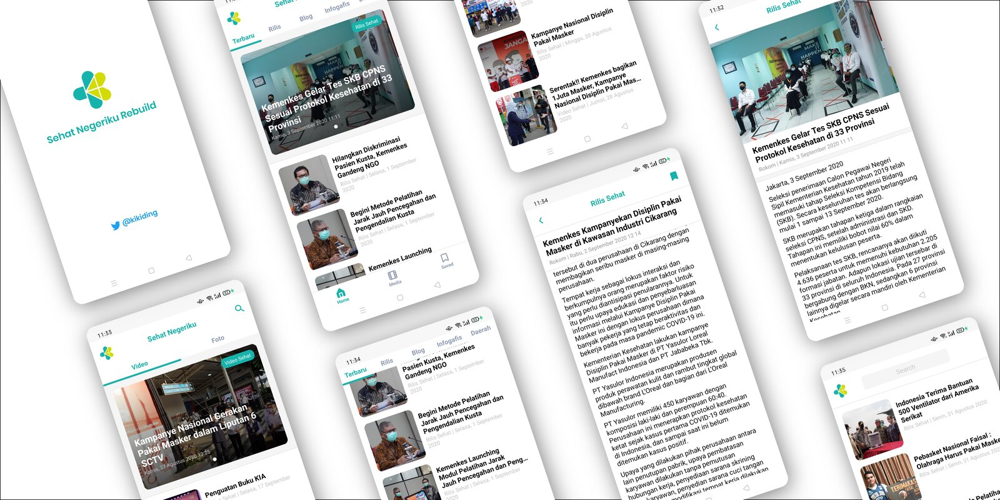
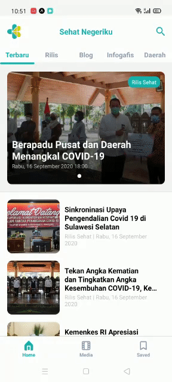
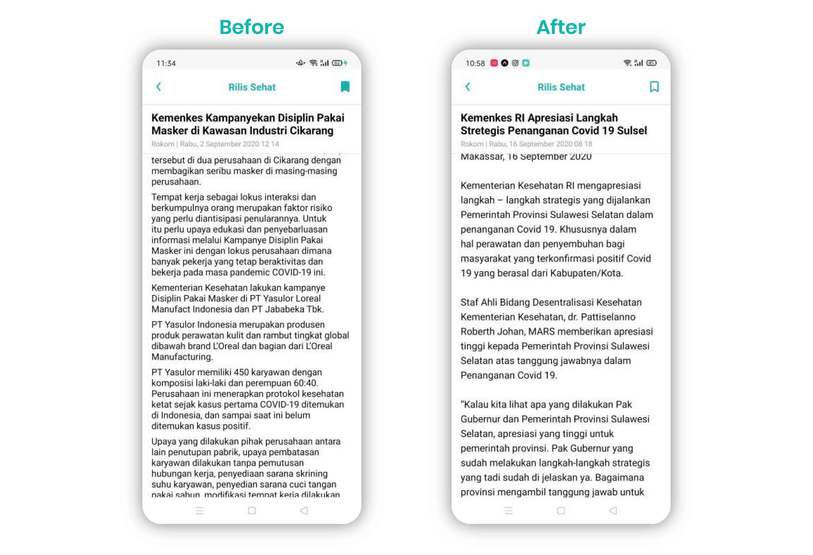

# Redesign & Rebuild "Sehat Negeriku" Kemenkes news portal app

This is unofficial Redesign & Rebuild project by me.

## Using :

- React Native
- Expo
- Graphql
- React navigation
- UI Kitten

## To do :

- [x]  Delete some unused files
- [x]  Refactoring some components
- [x]  Implementing infinite scroll
- [x]  In detail page (single page) article no need to request data
- [x]  Implementing shared element for navigation transitions
- [ ]  Upload to playstore 🥳

## Update :

- Shared element transitions

    

- Better reading experience

    

Full read case study : [https://twitter.com/kikiding/status/1302211106958573568](https://twitter.com/kikiding/status/1302211106958573568)

Try it on expo : [https://expo.io/@kidingki/sehatnegeriku](https://expo.io/@kidingki/sehatnegeriku)
